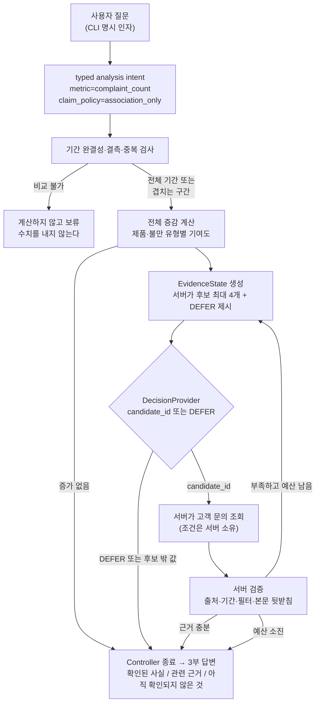

# bounded-investigation-agent

"지난달보다 고객 불만이 왜 늘었어?" **한 종류의 질문만** 조사하는 명령줄 도구. 증감과 기여 그룹은 코드가 결정론적으로 계산하고, 모델은 서버가 만든 닫힌 후보 중 "다음에 무엇을 볼지" ID 하나만 고른다.

---

## 데모

```
$ python3 -m bia.cli demo --case normal

## 확인된 사실
- 비교 대상 기간: 현재 2026-07-01..2026-07-30 (일자 30/30 수신), 기준 2026-06-01..2026-06-30 (일자 30/30 수신)
- 비교 구간 불만 건수: 현재 1903건, 기준 1696건, 차이 +207건
- 기준 대비 변화율 +12.21%
- 제품별로 증가분이 발생한 위치: P-Beta +164건 (증가분의 78%), P-Alpha +32건 (증가분의 15%)
- 불만 유형별로 증가분이 발생한 위치: 배송 지연 +146건 (증가분의 71%), 앱 비정상 종료 +19건 (증가분의 9%), 파손 배송 +17건 (증가분의 8%)

## 관련 근거
- 아래는 같은 구간·같은 그룹에서 관측된 고객 문의다. 증가와 함께 나타난 내용이며, 증가를 설명하는 근거로 확정된 것이 아니다
- 조사 대상 [P-Beta / 배송 지연]: 검증 통과 54건 / 해당 구간 문의 60건 (coverage 0.90)
-   검증에서 제외된 문의 6건: text_does_not_support_its_own_label 6건
-   T-000603 (2026-07-02, 배송 지연, 출처 in_app): [synthetic] The parcel has not arrived yet. (product P-Beta)
-   ...

## 아직 확인되지 않은 것
- 무엇이 이 증가를 만들었는지: 이 데이터로는 확인되지 않는다. 위의 그룹별 수치는 증가분이 '어디서 발생했는지'이며 '왜 발생했는지'가 아니다
- 조사하지 않은 후보: R1-C2, R1-C3, R1-C4 — 이번 실행은 조사 호출 1회, 조회 1회를 쓰고 종료했다 (evidence_sufficient)
- 외부 변화(캠페인, 배포, 계절성 등)와의 관계: 이 시스템은 해당 데이터를 가지고 있지 않다

---
종료 사유: evidence_sufficient | decision 호출 1회 (상한 2) | retrieval 1회 (상한 2) | selector heuristic
모델 호출: 없음 (오프라인 결정론 selector)
```

부분 기간이 들어오면 전체 기간끼리 비교하지 않는다.

```
$ python3 -m bia.cli demo --case partial

- 비교 대상 기간: 현재 2026-07-01..2026-07-30 (일자 16/30 수신), 기준 2026-06-01..2026-06-30 (일자 30/30 수신)
- 현재 기간에 데이터가 없는 날이 14일 있다 (2026-07-17, 2026-07-18, ...)
- 두 기간의 수신 일자가 달라 전체 기간끼리 비교하지 않았다. 양쪽에 모두 존재하는 구간 현재 2026-07-01..2026-07-16 대 기준 2026-06-01..2026-06-16 으로만 비교했다
```

근거가 없으면 그럴듯한 근거를 채우지 않고 보류한다.

```
$ python3 -m bia.cli demo --case no-evidence

## 관련 근거
- 검증을 통과한 고객 문의 근거가 없다
- 조사 가능한 후보가 근거 기준을 충족하지 못해 보류했다
...
종료 사유: provider_deferred | decision 호출 1회 (상한 2) | retrieval 0회 (상한 2)
```

---

## 목차

- [무엇을 푸는가](#무엇을-푸는가)
- [설계 원칙](#설계-원칙)
- [사용 기술](#사용-기술)
- [시작하기](#시작하기)
- [폴더 구조](#폴더-구조)
- [사용법](#사용법)
- [평가](#평가)
- [구현된 것과 아직 아닌 것](#구현된-것과-아직-아닌-것)
- [알려진 한계](#알려진-한계)
- [라이선스](#라이선스)

---

## 무엇을 푸는가

"불만이 왜 늘었냐"는 질문에 LLM을 그대로 붙이면 세 가지가 조용히 무너진다.

| 증상 | 무너지는 지점 |
|---|---|
| 숫자가 그럴듯하지만 틀림 | 모델이 집계·비교를 직접 한다 |
| 7월 16일치를 6월 한 달과 비교 | 기간 완결성을 아무도 확인하지 않는다 |
| "배송 지연 때문입니다" | 기여(어디서 늘었나)와 원인(왜 늘었나)을 구분하지 않는다 |

이 저장소는 그 세 가지를 **모델에게서 회수**한 뒤, 남은 좁은 구멍 하나에만 모델을 둔다.

이 프로젝트가 답하려는 질문은 하나다.

> 추가적인 probabilistic decision이, 코드만 사용한 기준선보다 유용한 근거를 더 찾는가?
> 그 이득이 호출 비용과 지연을 감수할 만한가?

v0는 이 질문에 **답하지 않는다.** 답할 수 있는 판(고정된 24개 시나리오, 고정된 채점기, 코드만 쓴 기준선)을 만든다.

### 흐름



---

## 설계 원칙

**1. 모델은 계산하지 않는다.** 증감·기여도·비율은 전부 `bia/metrics.py`의 산술이다. 모델이 숫자를 만들 경로가 없다.

**2. 모델은 검색 조건을 쓰지 않는다.** 후보의 의미·필터·실행 권한은 서버가 정한다. 모델이 돌려줄 수 있는 값은 후보 ID 하나 또는 `DEFER` 뿐이다. 그 외의 값(후보 밖 ID, 빈 문자열, SQL 문자열, 문자열이 아닌 값)은 **DEFER로 강등되고 위반으로 기록**된다.

**3. 검증은 생략될 수 없다.** 조회된 문의는 전부 다시 검사한다 — 저장소에 있는 ID인가, 허용된 출처인가, 비교 구간 안인가, 요청한 필터에 맞는가, **본문이 자기 라벨을 뒷받침하는가**. 마지막 항목이 "배송 지연으로 분류됐지만 내용은 전혀 다른" 문의를 근거에서 걸러낸다.

**4. 종료는 Controller가 결정한다.** 모델의 어휘에는 종료 토큰이 없다.

**5. 기여와 원인을 섞지 않는다.** 답변 생성기에 두 개의 기계 가드가 있다.
- 본문에 등장하는 모든 숫자는 계산된 값에서 등록된 것이어야 한다. 산문 템플릿이 숫자를 만들어 넣으면 `UnsupportedNumberError`로 실행이 멈춘다.
- 인과 어휘(`원인`, `때문`, `caused`, `due to`, `root cause` 등)가 시스템의 주장 구간에 들어가면 `CausalClaimError`로 멈춘다. 고객이 쓴 인용문은 이 검사에서 제외된다 — 고객은 "because"라고 쓸 수 있고, 시스템은 쓸 수 없다.

**6. 상위 기여 그룹에 근거가 없으면 보류한다.** 기준선 selector는 더 작은 다른 그룹의 문의로 갈아타지 않는다. 증가가 P-Beta에 몰려 있는데 P-Alpha의 문의를 보여주면, 읽는 사람이 연관을 설명으로 오해하도록 초대하는 셈이다.

---

## 사용 기술

| 분류 | 기술 | 비고 |
|---|---|---|
| 언어 | Python 3.9 이상 | 3.9.6 / 3.11.14에서 검증. `from __future__ import annotations` 사용 |
| 의존성 | **없음** (표준 라이브러리만) | 설치 단계가 없어야 3분 안에 돌려볼 수 있다 |
| 테스트 | `unittest` | 외부 러너 없이 `python3 -m unittest` |
| 데이터 | 합성 데이터, 고정 seed | 실제 고객 데이터·개인정보 없음 |

---

## 시작하기

### 사전 준비

- Python 3.9 이상. 그 외 준비물 없음.

### 설치

```bash
git clone <this-repo>
cd bounded-investigation-agent
```

### 데이터 생성

평가용 합성 데이터와 oracle은 저장소에 커밋돼 있지만, 언제든 재생성할 수 있다. 같은 seed에서 **바이트 단위로 동일한** 결과가 나온다.

```bash
python3 -m bia.datagen
```

### 동작 확인

```bash
python3 -m unittest discover -t . -s tests -q     # 106 tests, OK
python3 scripts/check_datagen.py                  # 합성 데이터 자체 검사
python3 eval/run_eval.py                          # 24개 시나리오 평가, 종료코드 0이면 합격
python3 -m bia.cli demo --case normal
```

### 문제 해결

| 증상 | 원인과 해결 |
|---|---|
| `python3 -m unittest discover -s tests` 가 테스트 일부만 찾고 import 에러 | 최상위 디렉터리를 지정해야 한다. `-t .` 를 붙인다 |
| `시나리오 S01 가 없다` | `python3 -m bia.datagen` 을 먼저 실행한다 |
| `oracle 이 없다` (평가 실행 시) | 같음. 데이터 생성이 `data/oracle/oracle.json` 도 만든다 |
| `OracleAccessError` | 정상 동작이다. runtime 코드가 정답 파일을 열려고 하면 일부러 실패시킨다 |
| `UnsupportedNumberError` / `CausalClaimError` | 정상 동작이다. 답변에 출처 없는 숫자나 인과 단정이 들어가면 실행을 멈춘다 |

---

## 폴더 구조

```
bounded-investigation-agent/
├── bia/
│   ├── types.py          # Period, AnalysisIntent, EvidenceFilter, EvidenceCandidate
│   ├── integrity.py      # 기간 완결성·결측·중복, 비교 가능 구간 결정
│   ├── metrics.py        # 결정론적 증감·그룹 기여도
│   ├── evidence.py       # EvidenceState, 서버의 닫힌 후보 생성
│   ├── decision.py       # DecisionProvider 경계, heuristic·scripted selector
│   ├── retrieval.py      # 서버 필터로만 실행되는 문의 조회
│   ├── verify.py         # 출처·기간·필터·본문 뒷받침 검증
│   ├── controller.py     # 루프·예산·종료, fail-closed 선택 해석
│   ├── answer.py         # 3부 답변 렌더링 + 숫자·인과 가드
│   ├── lexicon.py        # 서버 소유 어휘 (제품·불만 유형·뒷받침 용어)
│   ├── store.py          # 데이터 로딩, oracle 접근 차단
│   ├── scenarios.py      # 24개 시나리오 스펙
│   ├── datagen.py        # 합성 데이터·oracle 생성기
│   └── cli.py            # 명령줄 진입점
├── data/
│   ├── scenarios/S01..S24/  # metrics.csv, tickets.jsonl, scenario.json
│   └── oracle/oracle.json   # 정답. 평가기만 읽는다
├── eval/
│   ├── CRITERIA.md       # 합격 기준 (평가 실행 전 고정)
│   ├── run_eval.py       # 채점기
│   └── results/          # 실행 결과
├── scripts/
│   └── check_datagen.py  # 합성 데이터 자체 검사
├── tests/                # 106 tests
└── SCOPE.md              # 범위·비범위·권한 경계·완료 조건
```

---

## 사용법

```bash
python3 -m bia.cli list-scenarios                 # 생성된 24개 시나리오
python3 -m bia.cli run --scenario S14             # 하나 조사
python3 -m bia.cli run --scenario S14 --json      # 구조화된 실행 기록
python3 -m bia.cli demo --case partial            # 데모 3종
```

| 옵션 | 기본값 | 설명 |
|---|---|---|
| `--scenario` | (필수) | `S01`~`S24` |
| `--selector` | `heuristic` | 현재 선택 가능한 값은 `heuristic` 하나 |
| `--json` | 꺼짐 | intent·EvidenceState·후보·검증 결과·답변 전체를 JSON으로 |
| `--case` | (필수) | `normal`, `partial`, `no-evidence` |

`--json` 출력의 `state` 에는 비교 구간과 기간 완결성, 전체 증감, 상위 기여 제품·불만 유형, 이미 조사한 후보, 찾은 문의 ID와 출처, coverage, decision 호출 수와 retrieval 횟수, 경계 위반 기록이 들어 있다.

---

## 평가

24개 시나리오는 정상 증가 6, 부분 기간 3, 결측 2, 중복 2, 잘못된 상위 기여 그룹 3, 근거 부족 3, 교란·잘못된 출처 3, 증가 없음 2로 구성된다.
합격 기준은 **평가를 실행하기 전에** `eval/CRITERIA.md` 에 고정하고 커밋했다.

`DeterministicHeuristicSelector`(코드만, 모델 호출 0회) 결과:

| 지표 | 기준 | 결과 |
|---|---|---|
| 잘못된 수치의 확신 출력 | 0건 | **0건** |
| 근거 없는 인과 단정 | 0건 | **0건** |
| 부분 기간을 전체 기간처럼 비교 | 0건 | **0건** |
| 검증 미통과 문의의 근거 유출 | 0건 | **0건** |
| 수치 정확도 | 24/24 | **24/24** |
| 기간 판정 정확도 | 24/24 | **24/24** |
| 기여 그룹 정확도 | 24/24 | **24/24** |
| evidence recall (macro) | ≥ 0.70 | **0.9412** |
| evidence precision (macro) | ≥ 0.80 | **1.0** |
| 올바른 DEFER | 전부 | **7/7** |
| 호출 예산 초과 | 0건 | **0건** |
| 지연·모델 비용 | — | **not_measured** (실제 모델 호출이 없다) |

24개 전체에서 decision 호출 21회, retrieval 19회를 썼다. 두 번째 조사까지 간 시나리오는 2개(S19, S20)다.

recall 0.9412 를 끌어내린 유일한 시나리오는 S18이다. 상위 기여 셀에 문의가 2건뿐이라 근거 기준(3건)을 넘지 못했고, selector가 보류했다. 보류가 옳은 동작이므로 이 0점은 설계대로다.

---

## 구현된 것과 아직 아닌 것

| | 상태 |
|---|---|
| typed intent, 기간 검사, 증감·기여도 계산 | 구현됨 |
| 서버의 닫힌 후보 생성, 검증, fail-closed Controller | 구현됨 |
| 3부 답변 + 숫자·인과 기계 가드 | 구현됨 |
| `DeterministicHeuristicSelector` (기준선) | 구현됨 |
| `ScriptedSelector` (실패·안전 경계 테스트용) | 구현됨 |
| 24개 오프라인 평가, 고정 채점기 | 구현됨 |
| **모델(JEV) adapter** | **없음** |
| **실제 모델 호출** | **없음 — 한 번도 하지 않았다** |
| **모델 비용·지연 수치** | **없음 — 측정하지 않았으므로 적지 않는다** |
| 자유 자연어 질문 파서 | 범위 밖 |

모델을 붙이지 않았으므로 "모델이 개선했다"는 주장은 이 저장소에 없다.
비교는 같은 24개 시나리오·같은 채점기로만 유효하며, 채점 기준이 바뀌면 비교는 무효다.

---

## 알려진 한계

- **질문군이 하나다.** 기간 간 불만 건수 증가 외에는 답하지 않는다. `AnalysisIntent.validate()` 가 다른 질문을 거부한다.
- **인과를 말하지 않는다.** 개입·대조 설계 없이 인과를 주장할 수 없고, 이 시스템에는 그 데이터가 없다. 답변은 항상 "어디서 늘었는가"까지다.
- **비교 구간 정책이 고정돼 있다.** 두 기간에 공통으로 존재하는 최장 연속 구간이 기간 길이의 절반(최소 7일) 이상이어야 비교한다. 그 아래면 수치를 내지 않는다.
- **precision 지표가 기준선에서는 변별력이 없다.** heuristic은 셀 후보만 고르므로 항상 1.0이다. 서버는 제품·유형 수준의 넓은 후보도 함께 제시하므로, 이 지표는 그런 후보를 고르는 provider가 붙을 때 비로소 변별한다.
- **합성 데이터다.** 실제 고객 문의의 표현 다양성·라벨 노이즈를 재현하지 않는다. 본문 뒷받침 검사는 고정된 용어 목록에 의존한다.
- **동시성·규모를 다루지 않는다.** 단일 프로세스, 단일 실행, 인메모리.

---

## 라이선스

MIT. `LICENSE` 참고. 외부 의존성이 없어 추가로 확인할 라이선스가 없다.
