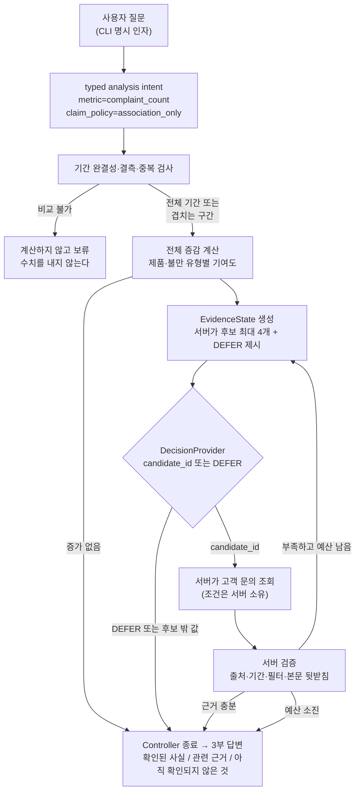

# bounded-investigation-agent

> A small reference implementation and benchmark for testing where probabilistic
> decision models belong in an analytical investigation pipeline.

분석 파이프라인에서 **확률적 결정 모델을 어디에 두어야 하는지**를 실제 코드와 시험지로 검증한 기록이다. 범용 분석 도구가 아니다.

정형 데이터의 계산·검증은 코드가 결정론적으로 수행하고, 답이 하나로 정해지지 않는 **근거 선택 지점에서만** 결정 모델을 쓴다. 그 배치가 실제로 이득인지를 같은 시험지 위에서 세 selector로 비교했다 — 좁은 휴리스틱, 강한 코드 규칙, 그리고 실제 모델.

### 이 벤치마크에서 나온 결과

> In this benchmark, JEV improved over a narrow heuristic but did not outperform a
> stronger deterministic policy. It also added substantial latency without increasing
> evidence yield. More importantly, **server-side verification prevented unsupported
> evidence from reaching the final answer regardless of the decision strategy.**

| | heuristic | greedy | JEV |
|---|---|---|---|
| 근거 확보율 | 0.3718 | **0.6582** | 0.5955 |
| 전체 지연 | 69.9 ms | 66.2 ms | 8,294.7 ms |
| **최종 잘못된 근거** | **0건** | **0건** | **0건** |

**Decision quality and system safety are different problems.** selector 둘이 함정에서 판단을 틀렸는데도 최종 잘못된 근거는 0건이었다 — 그 경계를 서버가 쥐고 있었기 때문이다.

이 구조는 벤치마크 fixture에 묶여 있지 않다. 같은 계약의 외부 데이터를 `--data-dir` 로 넣으면 **동일한 파이프라인**이 그대로 돈다.

---

## 데모

```
$ python3 -m bia.cli demo --case normal

## 확인된 사실
- 비교 대상 기간: 현재 2026-07-01..2026-07-30 (일자 30/30 수신), 기준 2026-06-01..2026-06-30 (일자 30/30 수신)
- 비교 구간 불만 건수: 현재 1903건, 기준 1696건, 차이 +207건
- 기준 대비 변화율 +12.21%
- 제품별로 증가분이 발생한 위치: P-Beta +164건 (늘어난 그룹 합계의 78%), P-Alpha +32건 (늘어난 그룹 합계의 15%)
- 제품별로 늘어난 그룹의 합은 +210건이고 순증가는 +207건이다. 차이는 같은 구간에 줄어든 그룹이 상쇄한 몫이므로, 위 비율은 순증가가 아니라 늘어난 그룹 합계를 기준으로 읽어야 한다
- 불만 유형별로 증가분이 발생한 위치: 배송 지연 +146건 (늘어난 그룹 합계의 71%), 앱 비정상 종료 +19건 (늘어난 그룹 합계의 9%), 파손 배송 +17건 (늘어난 그룹 합계의 8%)

## 관련 근거
- 아래는 같은 구간·같은 그룹에서 관측된 고객 문의다. 증가와 함께 나타난 내용이며, 증가를 설명하는 근거로 확정된 것이 아니다
- 조사 대상 [P-Beta / 배송 지연]: 검증 통과 54건 / 해당 구간 문의 60건 (coverage 0.90)
-   검증에서 제외된 문의 6건: text_does_not_support_its_own_label 6건
-   T-000603 (2026-07-02, 배송 지연, 출처 in_app): [synthetic] The parcel has not arrived yet. (product P-Beta)
-   ...

## 아직 확인되지 않은 것
- 무엇이 이 증가를 만들었는지: 이 데이터로는 확인되지 않는다. 위의 그룹별 수치는 증가분이 '어디서 발생했는지'이며 '왜 발생했는지'가 아니다
- 조사하지 않은 후보: R1-C2, R1-C3, R1-C4 — 이번 실행은 조사 호출 1회, 조회 1회를 쓰고 종료했다 (evidence_sufficient)
- 외부 변화(캠페인, 배포, 계절성 등)와의 관계: 이 시스템은 해당 데이터를 가지고 있지 않다

---
종료 사유: evidence_sufficient | decision 호출 1회 (상한 2) | retrieval 1회 (상한 2) | selector heuristic
모델 호출: 없음 (오프라인 결정론 selector)
```

부분 기간이 들어오면 전체 기간끼리 비교하지 않는다.

```
$ python3 -m bia.cli demo --case partial

- 비교 대상 기간: 현재 2026-07-01..2026-07-30 (일자 16/30 수신), 기준 2026-06-01..2026-06-30 (일자 30/30 수신)
- 현재 기간에 데이터가 없는 날이 14일 있다 (2026-07-17, 2026-07-18, 2026-07-19, 2026-07-20, 2026-07-21 외)
- 두 기간의 수신 일자가 달라 전체 기간끼리 비교하지 않았다. 양쪽에 모두 존재하는 구간 현재 2026-07-01..2026-07-16 대 기준 2026-06-01..2026-06-16 으로만 비교했다
```

근거가 없으면 그럴듯한 근거를 채우지 않고 보류한다.

```
$ python3 -m bia.cli demo --case no-evidence

## 관련 근거
- 검증을 통과한 고객 문의 근거가 없다
- 조사 가능한 후보가 근거 기준을 충족하지 못해 보류했다
...
종료 사유: provider_deferred | decision 호출 1회 (상한 2) | retrieval 0회 (상한 2)
```

---

## 목차

- [무엇을 푸는가](#무엇을-푸는가)
- [설계 원칙](#설계-원칙)
- [사용 기술](#사용-기술)
- [시작하기](#시작하기)
- [폴더 구조](#폴더-구조)
- [사용법](#사용법)
- [평가](#평가)
- [v2 — 도메인에 묶이지 않는 분석 계층](#v2--도메인에-묶이지-않는-분석-계층)
- [구현된 것과 아직 아닌 것](#구현된-것과-아직-아닌-것)
- [알려진 한계](#알려진-한계)
- [라이선스](#라이선스)

---

## 무엇을 푸는가

"불만이 왜 늘었냐"는 질문에 LLM을 그대로 붙이면 세 가지가 조용히 무너진다.

| 증상 | 무너지는 지점 |
|---|---|
| 숫자가 그럴듯하지만 틀림 | 모델이 집계·비교를 직접 한다 |
| 7월 16일치를 6월 한 달과 비교 | 기간 완결성을 아무도 확인하지 않는다 |
| "배송 지연 때문입니다" | 기여(어디서 늘었나)와 원인(왜 늘었나)을 구분하지 않는다 |

이 저장소는 그 세 가지를 **모델에게서 회수**한 뒤, 남은 좁은 구멍 하나에만 모델을 둔다.

이 프로젝트가 답하려는 질문은 하나다.

> 추가적인 probabilistic decision이, 코드만 사용한 기준선보다 유용한 근거를 더 찾는가?
> 그 이득이 호출 비용과 지연을 감수할 만한가?

v0는 이 질문에 **답하지 않는다.** 답할 수 있는 판(고정된 24개 시나리오, 고정된 채점기, 코드만 쓴 기준선)을 만든다.

### 흐름



---

## 설계 원칙

**1. 모델은 계산하지 않는다.** 증감·기여도·비율은 전부 `bia/metrics.py`의 산술이다. 모델이 숫자를 만들 경로가 없다.

**2. 모델은 검색 조건을 쓰지 않는다.** 후보의 의미·필터·실행 권한은 서버가 정한다. 모델이 돌려줄 수 있는 값은 후보 ID 하나 또는 `DEFER` 뿐이다. 그 외의 값(후보 밖 ID, 빈 문자열, SQL 문자열, 문자열이 아닌 값)은 **DEFER로 강등되고 위반으로 기록**된다.

**3. 검증은 생략될 수 없다.** 조회된 문의는 전부 다시 검사한다 — 저장소에 있는 ID인가, 허용된 출처인가, 비교 구간 안인가, 요청한 필터에 맞는가, **본문이 자기 라벨을 뒷받침하는가**. 마지막 항목이 "배송 지연으로 분류됐지만 내용은 전혀 다른" 문의를 근거에서 걸러낸다.

**4. 종료는 Controller가 결정한다.** 모델의 어휘에는 종료 토큰이 없다.

**5. provider는 실행 상태를 만지지 못한다.** DecisionProvider가 받는 `state`는 살아 있는 객체가 아니라 `EvidenceState.view()`가 만든 **깊은 복사본**이고, 후보는 전부 불변 객체다. 복사본을 고쳐도 계산된 수치, 조회 필터, 검증 결과, 위반 기록 중 무엇도 바뀌지 않는다. provider가 예외를 던져도 Controller가 잡아 DEFER로 강등하고 위반으로 기록한다. 이 경계가 없으면 모든 보장이 "adapter를 믿는다"로 바뀐다.

**6. 기여와 원인을 섞지 않는다.** 답변 생성기에 두 개의 기계 가드가 있다.
- 본문에 등장하는 모든 숫자는 계산된 값에서 등록된 것이어야 한다. 산문 템플릿이 숫자를 만들어 넣으면 `UnsupportedNumberError`로 실행이 멈춘다.
- 인과 어휘(`원인`, `때문`, `caused`, `due to`, `root cause` 등)가 시스템의 주장 구간에 들어가면 `CausalClaimError`로 멈춘다. 고객이 쓴 인용문은 이 검사에서 제외된다 — 고객은 "because"라고 쓸 수 있고, 시스템은 쓸 수 없다.

**7. 상위 기여 그룹에 근거가 없으면 보류한다.** 기준선 selector는 더 작은 다른 그룹의 문의로 갈아타지 않는다. 증가가 P-Beta에 몰려 있는데 P-Alpha의 문의를 보여주면, 읽는 사람이 연관을 설명으로 오해하도록 초대하는 셈이다.

---

## 사용 기술

| 분류 | 기술 | 비고 |
|---|---|---|
| 언어 | Python 3.9 이상 | 3.9.6 / 3.11.14에서 검증. `from __future__ import annotations` 사용 |
| 의존성 | **없음** (표준 라이브러리만) | 설치 단계가 없어야 3분 안에 돌려볼 수 있다 |
| 테스트 | `unittest` | 외부 러너 없이 `python3 -m unittest` |
| 데이터 | 합성 데이터, 고정 seed | 실제 고객 데이터·개인정보 없음 |

---

## 시작하기

### 사전 준비

- Python 3.9 이상. 그 외 준비물 없음.

### 설치

```bash
git clone <this-repo>
cd bounded-investigation-agent
```

### 데이터 생성

평가용 합성 데이터와 oracle은 저장소에 커밋돼 있지만, 언제든 재생성할 수 있다. 같은 seed에서 **바이트 단위로 동일한** 결과가 나온다.

```bash
python3 -m bia.datagen
```

### 동작 확인

```bash
python3 -m unittest discover -t . -s tests -q     # 514 tests, OK
python3 scripts/check_datagen.py                  # 합성 데이터 자체 검사
python3 eval/run_eval.py                          # 24개 시나리오 평가, 종료코드 0이면 합격
python3 -m bia.cli demo --case normal

python3 -m bia.v2bench.generate                   # v2 벤치마크 데이터·oracle 생성
python3 scripts/check_v2bench.py                  # 디스크에서 다시 세어 oracle 대조
```

### 문제 해결

| 증상 | 원인과 해결 |
|---|---|
| `python3 -m unittest discover -s tests` 가 테스트 일부만 찾고 import 에러 | 최상위 디렉터리를 지정해야 한다. `-t .` 를 붙인다 |
| `시나리오 S01 가 없다` | `python3 -m bia.datagen` 을 먼저 실행한다 |
| `oracle 이 없다` (평가 실행 시) | 같음. 데이터 생성이 `data/oracle/oracle.json` 도 만든다 |
| `OracleAccessError` | 정상 동작이다. runtime 코드가 정답 파일을 열려고 하면 일부러 실패시킨다 |
| `UnsupportedNumberError` / `CausalClaimError` | 정상 동작이다. 답변에 출처 없는 숫자나 인과 단정이 들어가면 실행을 멈춘다 |

---

## 폴더 구조

```
bounded-investigation-agent/
├── bia/
│   ├── types.py          # Period, AnalysisIntent, EvidenceFilter, EvidenceCandidate
│   ├── integrity.py      # 기간 완결성·결측·중복, 비교 가능 구간 결정
│   ├── metrics.py        # 결정론적 증감·그룹 기여도
│   ├── evidence.py       # EvidenceState, 서버의 닫힌 후보 생성
│   ├── decision.py       # DecisionProvider 경계, heuristic·scripted selector
│   ├── retrieval.py      # 서버 필터로만 실행되는 문의 조회
│   ├── verify.py         # 출처·기간·필터·본문 뒷받침 검증
│   ├── controller.py     # 루프·예산·종료, fail-closed 선택 해석
│   ├── answer.py         # 3부 답변 렌더링 + 숫자·인과 가드
│   ├── lexicon.py        # 서버 소유 어휘 (제품·불만 유형·뒷받침 용어)
│   ├── store.py          # 데이터 로딩, oracle 접근 차단
│   ├── scenarios.py      # 24개 시나리오 스펙
│   ├── datagen.py        # 합성 데이터·oracle 생성기
│   ├── cli.py            # 명령줄 진입점
│   ├── analysis/         # v2 typed 실행 계층 — 도메인 이름을 모른다
│   │   ├── spec.py       #   DomainSpec, MetricSpec (도메인이 선언하는 계약)
│   │   ├── request.py    #   AnalysisRequest, PeriodComparison (런타임 요청)
│   │   ├── compiler.py   #   요청 × 선언 → ExecutionPlan (모순은 여기서 거부)
│   │   ├── operators.py  #   AGGREGATE·COMPARE·BREAKDOWN·RANK 등 닫힌 6 연산자
│   │   ├── decompose.py  #   비율 metric 의 rate/mix/entry-exit 분해와 출력 정책
│   │   ├── engine.py     #   plan 실행
│   │   └── result.py     #   typed 산출물 (답변이 아니다)
│   ├── domains/          # 세 도메인의 **선언**. 동작 코드 없음
│   │   ├── complaints.py
│   │   ├── ecommerce.py
│   │   └── support_ops.py
│   └── v2bench/          # 벤치마크 사례와 독립 oracle 생성기
│       ├── cases.py      #   26 사례 (손 검산 결과를 notes 에 남긴다)
│       └── generate.py   #   Fraction 으로 다시 계산하는 oracle. 엔진을 import 하지 않는다
├── data/
│   ├── scenarios/S01..S24/  # metrics.csv, tickets.jsonl, scenario.json
│   ├── oracle/oracle.json   # 정답. 평가기만 읽는다
│   └── v2/C01..C26/         # v2 벤치마크 데이터 + oracle.json
├── eval/
│   ├── CRITERIA.md       # 합격 기준 (평가 실행 전 고정)
│   ├── run_eval.py       # 채점기
│   └── results/          # 실행 결과
├── scripts/
│   ├── check_datagen.py  # 합성 데이터 자체 검사
│   └── check_v2bench.py  # v2 벤치마크를 디스크에서 다시 계산해 대조
├── examples/
│   ├── custom-data-template/  # 자기 데이터로 돌려보는 최소 예시
│   └── README.md              # 두 파일 계약과 닫힌 값 목록
├── tests/                # 514 tests
└── SCOPE.md              # 범위·비범위·권한 경계·완료 조건
```

---

## 사용법

```bash
python3 -m bia.cli list-scenarios                 # 생성된 24개 시나리오
python3 -m bia.cli run --scenario S14             # 하나 조사
python3 -m bia.cli run --scenario S14 --json      # 구조화된 실행 기록
python3 -m bia.cli demo --case partial            # 데모 3종

# 자기 데이터로 돌리기 — metrics.csv 와 tickets.jsonl 두 파일만 있으면 된다
python3 -m bia.cli run --data-dir ./examples/custom-data-template \
  --current 2026-07-01:2026-07-07 --baseline 2026-06-01:2026-06-07
```

| 옵션 | 기본값 | 설명 |
|---|---|---|
| `--scenario` | (필수) | `S01`~`S24` |
| `--selector` | `heuristic` | 현재 선택 가능한 값은 `heuristic` 하나 |
| `--json` | 꺼짐 | intent·EvidenceState·후보·검증 결과·답변 전체를 JSON으로 |
| `--case` | (필수) | `normal`, `partial`, `no-evidence` |
| `--data-dir` | — | `metrics.csv` + `tickets.jsonl` 이 든 디렉터리. `--scenario` 와 함께 쓸 수 없다 |
| `--current` / `--baseline` | — | `--data-dir` 사용 시 필수. `START:END` (ISO, 양끝 포함) |

`--data-dir` 로 넣는 데이터는 **동결된 fixture와 같은 형식**이어야 한다: `metrics.csv` 는 `day,product,complaint_type,count`, `tickets.jsonl` 은 `ticket_id/day/product/complaint_type/text/source`. `complaint_type` 과 `source` 는 값이 닫혀 있고, 목록 밖 값은 로드 시점에 막는다 — [examples/README.md](examples/README.md) 참고. 컬럼 자동 인식·별칭·스키마 매핑은 **의도적으로 없다.**

CLI 에서는 모델 selector를 실행할 수 없다. 오프라인 코드 selector(`heuristic`, `greedy`)만 돈다 — 모델 호출은 과금되므로 CLI 한 줄로 발생시키지 않는다.

이것이 보이는 것은 **portability** 다: 같은 계약의 다른 데이터에서도 이 아키텍처가 돈다는 것. *"실제 고객불만 데이터에서도 JEV 성능이 이렇다"* 는 주장은 아니며, 이 저장소는 그것을 주장하지 않는다.

`--json` 출력의 `state` 에는 비교 구간과 기간 완결성, 전체 증감, 상위 기여 제품·불만 유형, 이미 조사한 후보, 찾은 문의 ID와 출처, coverage, decision 호출 수와 retrieval 횟수, 경계 위반 기록이 들어 있다.

---

## 평가

24개 시나리오는 정상 증가 6, 부분 기간 3, 결측 2, 중복 2, 잘못된 상위 기여 그룹 3, 근거 부족 3, 교란·잘못된 출처 3, 증가 없음 2로 구성된다.
합격 기준은 **평가를 실행하기 전에** `eval/CRITERIA.md` 에 고정하고 커밋했다.

`DeterministicHeuristicSelector`(코드만, 모델 호출 0회) 결과:

| 지표 | 기준 | 결과 |
|---|---|---|
| 잘못된 수치의 확신 출력 | 0건 | **0건** |
| 근거 없는 인과 단정 | 0건 | **0건** |
| 부분 기간을 전체 기간처럼 비교 | 0건 | **0건** |
| 검증 미통과 문의의 근거 유출 | 0건 | **0건** |
| 수치 정확도 | 24/24 | **24/24** |
| 기간 판정 정확도 | 24/24 | **24/24** |
| 기여 그룹 정확도 | 24/24 | **24/24** |
| evidence recall (macro) | ≥ 0.70 | **0.9412** |
| evidence precision (macro) | ≥ 0.80 | **1.0** |
| 올바른 DEFER | 전부 | **7/7** |
| 호출 예산 초과 | 0건 | **0건** |
| 지연·모델 비용 | — | **not_measured** (실제 모델 호출이 없다) |

24개 전체에서 decision 호출 21회, retrieval 19회를 썼다. 두 번째 조사까지 간 시나리오는 2개(S19, S20)다.

### 이 점수가 말하지 않는 것

표의 숫자를 그대로 읽으면 실제보다 세 보인다. 독립 감사에서 나온 지적을 그대로 적는다.

- **precision 1.0은 성취가 아니라 항등식이다.** 기준선 selector는 셀 후보만 고르고, 셀 후보는 정의상 delta > 0 인 셀이며, 검증 통과 집합은 oracle의 relevant 집합의 부분집합이다. 이 selector로는 1.0 외의 값이 나올 수 없다. 이 지표는 제품·유형 수준의 넓은 후보를 고르는 provider가 붙어야 비로소 변별한다.
- **"올바른 DEFER 7/7" 중 실제로 변별하는 것은 2건이다.** S09·S11·S13(비교 차단)과 S23·S24(증가 없음)는 Controller가 **DecisionProvider를 호출하기도 전에** 종료하므로, 어떤 selector를 써도 근거가 0건이다. selector의 보류 판단을 실제로 시험하는 것은 S17·S18 두 건뿐이다.
- **recall은 등급이 아니라 이진 지표다.** 값은 1.0 아니면 0.0만 나온다("oracle의 1순위 셀을 골랐는가"). 0.9412는 16개의 1.0과 1개의 0.0이다.
- **그 하나의 0.0(S18)은 Q-6과 충돌한다.** S18은 보류가 정답인 시나리오인데, 보류하면 recall이 0이 된다(분모가 문의 1건). 같은 범주인 S17은 대상 문의가 0건이라 분모에서 아예 빠진다. 같은 성격의 두 시나리오가 원칙이 아니라 문의 개수 때문에 다르게 채점된다.
- **oracle과 검증기가 술어 2개를 공유한다.** `supports_label` 과 `ALLOWED_TICKET_SOURCES` 는 정답 생성기와 검증기가 같은 코드를 쓴다. 둘 중 하나에 버그가 있으면 recall·precision은 그것을 잡지 못한다.

실제로 변별력이 있는 것은 Q-1·Q-2·Q-3(결정론적 산술과 기간 판정), S-3(부분 기간 차단), S-4(잘못된 출처 유출·본문 미뒷받침 문의 배제), Q-7이다. 이 항목들은 구현이 망가지면 눈에 띄게 실패한다.

---

## 평가 v1 — 후보 선택을 가르는 시험지

v0의 24개는 **경계가 오프라인에서 재현되는지**를 본다. 후보 선택의 우열은 보지 못한다 — 대부분의 사례에서 상위 delta 셀이 곧 최선의 근거원이라, 다르게 고를 이유가 없기 때문이다.

그래서 **후보 선택이 결과를 바꾸는 8개 사례**를 별도 계약(`eval/v1/CONTRACT.md`)으로 만들었다. v0의 24개·기준·결과는 동결하고 재채점하지 않는다.

설계 원칙 하나가 핵심이다: **더 나은 선택지가 반드시 서버 메뉴에 올라와 있다.** 서버는 상위 2개 셀 + 최상위 제품 + 최상위 불만 유형을 후보로 내므로, C02(증가가 한 제품의 5개 유형에 분산)와 C04(한 유형이 4개 제품에서 증가)에서는 **셀이 아닌 후보가 최선**이다. 메뉴에 없는 정답을 요구하지 않는다.

v0에서 드러난 지표 결함도 계약에 명시해 고쳤다: **보류가 정답인 사례는 근거량·정확도 지표에서 완전히 제외**한다. 보류했다는 이유로 감점되는 경로가 없다.

```bash
python3 -m bia.challengegen          # 8개 challenge 데이터·oracle 생성
python3 scripts/check_challenges.py  # 사례가 의도한 성질을 갖는지 자체 검사
python3 eval/v1/run_eval.py          # 기준선 측정
```

### 두 코드 기준선의 성적 — **둘 다 FAIL, 이유가 다르다**

기준선은 둘이다. `heuristic`은 셀 후보만 고르는 좁은 기준선이고, `greedy`는 같은 후보·같은 상태·같은 상한에서 확보 가능한 근거량을 최대화하는 기준선이다. **`greedy`는 좁은 기준선을 측정한 뒤에 추가됐고, 최초 사전등록의 일부가 아니다.** 규칙과 상수는 측정 전에 고정했고 측정은 각 1회다.

| 사례 | 무엇을 가르는가 | heuristic | greedy |
|---|---|---|---|
| C01 `decoy_top_cell` | 1순위 셀의 문의가 전부 라벨 미뒷받침 | 0.3500 | 0.5750 |
| C02 `spread_product` | **제품 수준 후보가 최선** | 0.1758 | **0.6953** |
| C03 `thin_top_cell` | pool이 작아 충분 판정이 조기 종료 | 0.0288 | **0.7194** |
| C04 `type_wide` | **유형 수준 후보가 최선** | 0.1561 | **0.7257** |
| C05 `trap_defer` | 그럴듯한 후보가 있어도 보류가 정답 | 근거 0건 | **근거 72건 (위반)** |
| C06 `complementary_cells` | 두 번째 조사를 실제로 써야 함 | 0.3465 | 0.3465 |
| C07 `clean_single` | 1회로 끝나는 것이 정답 | 1.0000 | 1.0000 |
| C08 `volume_decoy` | 양이 아니라 증가를 따라가는지 | 0.5455 | 0.5455 |

| 지표 | heuristic | greedy |
|---|---|---|
| V-2 evidence yield (macro) | 0.3718 — **최소선 0.40 미달** | **0.6582** — 통과 |
| V-3 evidence precision (macro) | 1.0 | 0.9759 |
| V-4 함정 사례 근거 0건 | **1/1 통과** | **0/1 실패** |
| V-5 낭비 조회 | 2 | 3 |
| V-6 decision 호출 / retrieval | 11 / 10 | 11 / 11 |
| 조사한 후보 종류 | `cell 10, product 0, type 0` | `cell 7, product 3, type 1` |
| 전체 판정 | **FAIL** (선택 성능 최소선 미달) | **FAIL** (함정 사례 위반) |

안전 4항(S-1~S-4)과 사실 정확도 8/8은 양쪽 모두 통과했다.

### v1.1 — 서버의 근거 채택 경계를 보강한 뒤

greedy의 C05 위반은 selector의 문제가 아니라 **서버의 공백**이었다. 검증기는 문의의 출처·날짜·필터·본문 라벨은 확인했지만, 그 문의가 **실제로 증가한 세부 그룹에 속하는지**는 확인하지 않았다. 그래서 제품 전체 조회가 쓸어온, 전혀 늘지 않은 그룹의 문의가 근거로 승격됐다.

v1.1에서 규칙 하나를 추가했다: **증가를 설명할 근거로는 증가한 세부 그룹의 문의만 채택한다.** 사례 전용 예외도, oracle 참조도 없다. 넓은 조회 자체는 계속 허용한다 — 막는 것은 조회가 아니라 승격이다. 검증기에서 건너뛸 수 없도록 필수 인자로 두었다.

| 지표 | heuristic v1.0 | heuristic v1.1 | greedy v1.0 | greedy v1.1 |
|---|---|---|---|---|
| V-2 evidence yield (macro) | 0.3718 | 0.3718 | 0.6582 | **0.6582** |
| V-3 evidence precision (macro) | 1.0 | 1.0 | 0.9759 | **1.0** |
| V-4 함정 사례 근거 0건 | 1/1 | 1/1 | **0/1** | **1/1** |
| V-5 낭비 조회 | 2 | 2 | 3 | 3 |
| V-6 decision / retrieval | 11 / 10 | 11 / 10 | 11 / 11 | 11 / 11 |
| 전체 판정 | FAIL | **FAIL** | FAIL | **PASS** |

**잘못된 근거 86건이 사라졌고 yield는 한 푼도 줄지 않았다.** C05의 72건과 C01의 14건이 전부 "증가하지 않은 그룹"에서 온 것이었다. 경계가 옳게 그어지면 버릴 것만 버린다 — 이 규칙이 근거를 깎아 안전을 산 것이 아니라는 증거다.

v0의 24개 평가 결과는 **바이트 단위로 불변**이다. v0의 기준선은 셀 후보만 고르고 셀 후보는 정의상 증가한 셀이므로, 이 규칙이 거부할 것이 애초에 없다. 이것이 사례 전용 예외가 아니라 일반 규칙이라는 확인이다.

이 보정은 **사후 안전 보정이며 v1.0 사전등록 결과의 대체가 아니다.** v1.0 결과는 `eval/v1/results/heuristic_v1_0.json`, `greedy_v1_0.json` 에 보존돼 있다.

부작용 하나를 미리 적어뒀고 그대로 나타났다: 채택된 문의가 구조적으로 "증가한 셀의 문의"가 되므로 **precision은 다시 1.0으로 고정되어 변별력을 잃는다.** v1.1에서 변별하는 지표는 yield·V-4·낭비 조회·호출 수다.

### V-4가 말하는 것과 말하지 않는 것

**V-4는 "잘못된 근거가 노출되지 않았다"의 증거이지, "selector가 보류를 선택했다"의 증거가 아니다.** 근거가 0건인 이유는 두 가지다 — selector가 DEFER를 돌려줬거나, 조회를 쓰고도 서버가 전부 거부했거나.

함정 사례 C05 실측:

| | selector가 보류를 선택 | 조회 소진 | V-4 |
|---|---|---|---|
| heuristic | **예** (`selector_defer=Y`) | 1회 | 통과 |
| greedy | **아니오** (`selector_defer=N`) | **2회** | 통과 |

greedy는 물러선 것이 아니다. 조회 2회를 다 쓰고 종료했고, 근거가 0건인 것은 **서버의 채택 경계가 막았기 때문**이다. 둘 다 V-4를 통과하지만 행동은 정반대다. 그래서 채점기는 `selector_deferred`와 함정 사례의 조회 소진량을 별도 관측값으로 기록한다(합격 기준이 아니다). **JEV가 "제때 보류했다"고 주장하려면 V-4 통과가 아니라 이 관측값을 봐야 한다.**

### 채점기 정정 — v1.0의 "안전 4항 0건"은 거짓 음성이었다

독립 반증에서 채점기 S-4의 구멍이 나왔다. "유용 집합에 없는 문의" 검사가 **런타임이 증가했다고 말한 셀**의 문의에만 걸려 있어서, 비증가 셀에서 채택된 문의는 어느 갈래에도 걸리지 않았다. 보존된 `greedy_v1_0.json`의 C05가 그 증거다 — 근거 72건 채택, 유용 0건, 그런데 `s4_leaks=[]`에 `S-4: 0`.

즉 **v1.0에서 그 유출을 잡은 것은 S-4가 아니라 V-4(함정 사례 1건)뿐이었다.** 채점기를 고쳤다: 채택된 모든 문의를 유용 집합과 대조하고, 기준이 되는 증가 셀 집합을 런타임이 아니라 oracle에서 가져오며, 둘이 어긋나면 실패시킨다. 지표 정의(§6.1)는 그대로다 — 구현이 정의에 못 미쳤던 것을 맞췄다.

고친 채점기로 두 기준선을 다시 채점했고 **수치는 그대로다**: heuristic 0.3718 FAIL, greedy 0.6582 PASS, 양쪽 S-4 0건·oracle↔런타임 셀 집합 불일치 0건. 이제 S-4=0은 의미를 갖는다.

### 이 결과가 말하는 것

**"근거를 더 찾는 것"과 "경계를 지키는 것"은 상충하지 않는다 — 경계를 서버가 쥐고 있을 때만.**

v1.0에서 greedy는 yield를 0.37에서 0.66으로 올리는 대가로 잘못된 근거 72건을 통과시켰다. 그때의 교훈은 "근거량 최대화가 경계를 무너뜨린다"였다. v1.1에서 같은 selector가 같은 yield를 유지하면서 위반을 0으로 만들었다. 달라진 것은 selector가 아니라 **서버가 무엇을 근거로 인정하는지**다.

이것이 이 프로젝트의 핵심 주장이다. 선택을 누가 하느냐보다, **채택을 누가 쥐느냐**가 안전을 결정한다. 선택을 모델에게 넘기더라도 채택 경계가 서버에 있으면 그 경계는 유지된다.

### JEV 비교 조건 (실행 전에 사전 등록)

같은 8개 사례·같은 oracle·같은 채점기·같은 호출 상한에서, 아래를 **전부** 충족해야 "JEV가 이겼다"고 말한다: yield +0.10 이상 개선, precision 비감소, 함정 보류 유지, 안전 4항 0건, retrieval 총합 비증가. ±0.10 이내면 "비겼다"로 보고 추가 호출의 비용·지연만 늘었다고 적는다. 안전 항목은 성능으로 상쇄되지 않는다.

승리 조건은 **두 기준선에 각각 따로** 적용하고, 주장 수위를 미리 정해뒀다.

| JEV가 이긴 상대 | 말할 수 있는 것 |
|---|---|
| 좁은 기준선(`heuristic`)만 | "좁은 휴리스틱보다 개선" — 그 이상은 아니다 |
| 좁은 기준선 + 강한 코드 기준선(`greedy`) | "모델을 쓸 실익이 관측됨" |
| 아무도 못 이김 | 추가 호출의 비용·지연만 늘었다고 보고한다 |

강한 코드 기준선을 이기려면 yield 0.7582 이상 + 조회 총합 11회 이하 + 안전·근거 조건 유지가 동시에 필요하다.

승리 조건의 "함정 보류 유지"는 **V-4(최종 근거 0건)** 로 정의돼 있다. 모델이 스스로 `DEFER` 를 골랐는지는 별도 관측값(`selector_deferred`)이며, 승패 판정에 쓰지 않는다. 둘을 섞어 말하지 않는다.

**이 8개 사례는 독립적인 미공개 시험지가 아니다.** C08은 데이터 실측을 본 뒤 개정됐다(계약 개정 1). 선택 정책을 비교하기 위해 저자가 구성한 진단용 사례 모음이며, held-out benchmark로 소개하지 않는다.

### JEV 실측 결과 (2026-09-22, 유료 실행 2회)

`typesafe-ai/jev` 를 `jev-1.13.0` 으로 핀해 TypeSafe 직접 API로 호출했다.
시나리오·oracle·채점 기준은 두 회차 모두 동결 상태였다.

**두 회차의 채점 결과가 완전히 같았다.** 8사례의 yield·precision·채택 건수·조회 수·고른 후보 종류·보류 여부까지 차이 0건이다. `seed` 가 문서화돼 있지 않아 재현을 보장할 수 없다고 적어 두었는데, **실측으로는 n=2 에서 정확히 일치했다.** 이것이 결정성을 증명하지는 않지만, 아래 격차를 표본 잡음으로 돌리기는 어렵게 만든다.

| | heuristic | greedy | **JEV** |
|---|---|---|---|
| V-2 evidence yield (macro) | 0.3718 | **0.6582** | 0.5955 |
| V-3 evidence precision | 1.0 | 1.0 | 1.0 |
| V-4 함정 근거 0건 | 1/1 | 1/1 | 1/1 |
| **최종 잘못된 근거** | **0건** | **0건** | **0건** |
| 모델이 함정에서 스스로 보류 | 예 | 아니오 | 아니오 |
| decision / retrieval | 11 / 10 | 11 / 11 | 10 / 10 |
| 실제 모델 호출 | 0 | 0 | **10** |
| 전체 지연 | 69.9 ms | 66.2 ms | **8,294.7 ms** |
| 결정당 평균 지연 | 0.0011 ms | 0.0027 ms | **811.8 ms** |
| 입력 / 출력 토큰 | — | — | 13,337 / 660 |
| 비용 (추정) | $0 | $0 | **~$0.00056** |

지연은 벽시계 기준이고 코드 기준선 쪽은 Python 호출 오버헤드에 묻히는 값이라 **바닥값**으로만 읽어야 한다. 그 한계를 감안해도 규모 차이는 분명하다 — 전체 실행이 약 **125배**, 결정 하나당은 **다섯 자릿수 배**다.

비용은 응답 본문에 없어 `usage.input_tokens` 와 공개 요율로 계산한 **추정치**다. 1회차는 telemetry 를 기록하지 않아 지연·토큰·비용을 **사후에도 측정할 수 없다** ([정정 문서](eval/v1/results/jev_RECORD_CORRECTION.md)). 위 수치는 2회차(`jev_run2.json`)의 것이다. 요약의 `V-7_latency_and_model_cost` 필드는 telemetry 도입 이전의 라벨이 남은 것이고, 실제 측정치는 같은 문서의 `telemetry` 블록에 있다.

**판정 (기준 사후 변경 없음)**

- **좁은 기준선 상대: 사전 등록한 5개 조건을 전부 충족했다.** yield +0.2237, precision 비감소, V-4 유지, 안전 4항 0건, retrieval 10 ≤ 10. 말할 수 있는 것은 **"좁은 휴리스틱보다 개선"** 까지다.
- **강한 코드 기준선 상대: 이기지 못했다.** yield 가 **0.0627 낮다.** 사전 등록 문구에서 "±0.10 이내면 비김"과 "낮으면 짐"이 이 구간에서 겹친다. 유리한 쪽을 고르지 않고 셋을 함께 적는다 — **승리 아님 · 원점수는 낮음 · 차이는 무승부 범위 안.**
- **비용·지연을 감수할 만했는가: 아니다.** 근거를 더 찾지 못했는데 지연은 두 자릿수 배로 늘었다.

**차이가 난 곳은 두 사례뿐이고, 서로 반대로 당겼다**

- `C03 thin_top_cell`: greedy 0.7194 vs JEV 0.0288. JEV 는 문의가 5건뿐인 최대 delta 셀을 골랐고, pool 이 작아 coverage 가 높게 나와 1회 만에 충분 판정으로 끝났다. 좁은 기준선과 같은 함정에 걸렸다.
- `C06 complementary_cells`: greedy 0.3465 vs JEV 0.5984. JEV 는 유형 수준 후보를 골라 **조회 1회로** 더 많은 근거를 얻었다.

넓힐 값어치가 있을 때 넓히는 판단은 했고, 근거의 양을 가늠하는 판단은 하지 못했다 — 후보 설명에 조회 가능한 문의 수를 적어줬는데도 그렇다. 세는 일은 코드가 더 잘했다.

**잘못된 근거를 막은 것은 모델이 아니라 서버다**

함정 사례에서 greedy 도 JEV 도 물러서지 않았다. 둘 다 조회 예산을 전부 쓰고 근거 0건으로 끝났다(`selector_defer=N`). 그런데도 **세 selector 전부 최종 잘못된 근거가 0건이다.** 서버의 채택 규칙이 증가하지 않은 그룹의 문의를 거부했기 때문이다. 실제로 보류를 **선택**한 것은 좁은 기준선뿐이다.

**어떤 파일이 재현되고 어떤 파일이 안 되는지**

| 파일 | 재현 가능한가 |
|---|---|
| `data/scenarios/**`, `data/challenges/**`, `data/oracle/**` | **예.** `python3 -m bia.datagen` / `bia.challengegen` 로 바이트 동일하게 재생성된다 (고정 seed, 인터프리터 3.9/3.11 교차 확인) |
| `eval/results/heuristic.json`, `eval/v1/results/{heuristic,greedy}.json` | **예.** 코드 selector라 언제든 다시 돌리면 같은 값이 나온다 (지연 수치만 머신에 따라 다르다) |
| `eval/v1/results/jev.json`, `jev_run2.json` | **아니오.** 유료 호출로만 만들어진다. 바이트 그대로 보존하며, 채점기는 이 파일들을 덮어쓰지 않는다 — 재실행하려면 `--label` 이 필요하다 |
| `eval/v1/results/*_v1_0.json`, `heuristic_before_amendment1.json` | **아니오 (의도적).** 계약 개정 이전 시점의 기록이다. 그때 무엇이 측정됐는지 남기려고 보존한다 |

동결된 것은 **데이터와 채점 기준**이지 코드가 아니다. 코드는 계속 고쳤고(마지막이 외부 데이터 경계 수정), 고칠 때마다 위 재현 가능한 파일들이 바이트 불변인지 확인했다. 그것이 "코드를 고쳐도 벤치마크는 움직이지 않았다"의 증거다.

**결과 파일을 인용할 때**

- 1회차 `eval/v1/results/jev.json` 은 유료 산출물이라 바이트 그대로 보존한다. **[정정 문서](eval/v1/results/jev_RECORD_CORRECTION.md)를 반드시 함께 읽어야 한다** — 그 파일의 `real_model_calls: 0` 은 사실이 아니고, telemetry 가 없다.
- `passed: true` 는 **안전·평가 관문을 통과했다는 뜻이지 greedy 상대 승리가 아니다.**
- 채점기는 모델이 답한 결과 파일을 덮어쓰지 않는다. 재실행하려면 `--label` 이 필요하다.

## v2 — 도메인에 묶이지 않는 분석 계층

v0·v1 의 계산 계층은 "제품 × 불만 유형의 건수" 하나에 맞춰 짜여 있었다. 도메인이 코드에 녹아 있으면 새 질문마다 계산 코드를 다시 쓰게 되고, 그때마다 검증도 처음부터 다시 해야 한다.

v2 는 그 자리에 **타입 있는 실행 계층**을 둔다. 도메인은 `DomainSpec`·`MetricSpec` 으로 **선언**만 하고, 실행은 도메인 이름을 전혀 모른다 — `bia/analysis/` 안에 도메인 이름 문자열이 없다는 것을 AST 검사가 테스트로 강제한다.

### 무엇이 일반화됐나

| | v0/v1 | v2 |
|---|---|---|
| 도메인 | 코드에 고정 | `DomainSpec` 데이터 (grain·차원·metric) |
| metric | 건수 하나 | additive(합) · ratio(비율) 두 종류 |
| 분해 | 그룹별 증감 | 비율은 rate / mix / entry-exit 세 항으로 분해 |
| 연산자 | — | AGGREGATE · COMPARE · BREAKDOWN · RANK 등 **닫힌 6개** |

선언과 요청이 모순되면 실행이 아니라 **컴파일에서** 거부한다(예: 합계 metric 에 `rank_by="rate_effect"` 를 요구하면 `RequestError`). 분모 없는 분자, grain 충돌 중복 행, 선언된 상한을 넘는 분자는 숫자를 내지 않고 `AnalysisRefused` 로 멈춘다.

### 세 도메인

| 도메인 | grain | metric |
|---|---|---|
| `complaints` | day × product × complaint_type | `complaint_count` (합) |
| `ecommerce` | day × channel × device × category | `revenue`·`orders` (합), `conversion_rate` (비율) |
| `support_ops` | day × queue × priority | `tickets_received` (합), `sla_resolution_rate` (비율) |

### 26 사례 벤치마크와 독립 oracle

`data/v2/` 에 26 사례의 CSV 와 기대값이 들어 있다. 핵심은 사례 수가 아니라 **기대값이 어디서 오는가**다.

- oracle 생성기(`bia/v2bench/generate.py`)는 `bia.analysis` 도 `bia.metrics` 도 **import 하지 않는다.** 같은 코드를 부르면 엔진의 버그를 그대로 복제해 벤치마크가 아무것도 증명하지 못한다. 도메인 계약과 분해 수식을 다시 진술하고 `Fraction` 으로 정확히 계산한다.
- 이 독립성은 사람 기억이 아니라 테스트가 지킨다 — 모듈의 **AST** 에서 금지 import 를 찾고, 별도 프로세스에서 생성기를 import 한 뒤 `sys.modules` 에 피검 모듈이 없음을 확인한다(간접 import 까지 잡는다).
- 검사기(`scripts/check_v2bench.py`)는 생성기 함수도 재사용하지 않는다. 디스크의 CSV 를 직접 읽어 세 번째로 다시 센다. 재생성이 바이트 동일한지도 함께 본다.
- 사례 수는 테스트에 **정확한 숫자로** 박혀 있다. 부등식으로 두면 사례가 조용히 사라져도 통과한다.

벤치마크는 실제로 production 결함을 하나 찾았다: `RANK` 가 부동소수 값을 허용오차 없이 비교해, 수학적으로 동률인 두 그룹이 1 ulp 차이로 갈리면서 **선언된 tie-break 이 아예 발동하지 않았다.** 지금은 `FLOAT_TOL` 안의 차이를 동률로 보고 선언된 순서 규칙이 지배한다(C25 가 이 계약을 end-to-end 로 고정한다).

### v1 은 동결돼 있다

v1 은 `v1.0.0` 태그로 고정돼 있고 v2 작업의 **regression 은 0** 이다. v0 의 `eval/results`, v1 의 `eval/v1/results`(머신 의존 지연 수치 제외), `data/scenarios`·`data/challenges`·`data/oracle` 가 전부 무변경임을 재실행으로 확인한다. v1 채점기가 내는 `V-2_floor FAIL` 도 `v1.0.0` 태그와 동일하다 — 좁은 기준선이 사전 등록된 0.40 yield floor 를 넘지 못한다는 **기록된 결과**이지 결함이 아니고, 그 숫자는 결과를 본 뒤에 옮기지 않는다.

### 이 벤치마크가 주장하지 않는 것

- **"엔진이 본 적 없는 새 형태"를 시험한 것이 아니다.** 시험한 것은 *등록된 선언적 도메인 → 디스크 CSV → 엔진을 못 보는 oracle* 로 이어지는 end-to-end 경로다.
- **일반화 증거의 무게는 주로 `ecommerce` 에 있다.** `support_ops` 는 grain 구조가 `complaints` 와 사실상 같아, 두 번째 도메인이 형식적 존재를 크게 넘지 않는다.
- **실데이터 검증은 없다.** 사례는 전부 손으로 검산 가능한 작은 정수이고, 표현 다양성·라벨 노이즈·결측 패턴 같은 실제 데이터의 성질은 들어 있지 않다.
- **분석 계층은 v0/v1 파이프라인에 연결돼 있지 않다.** `bia/domains/*` 는 어디서도 자동 import 되지 않고, 벤치마크와 테스트가 명시적으로 등록한다. CLI·adapter 가 새 도메인을 쓰려면 등록 시점을 따로 정해야 한다.

---

## 구현된 것과 아직 아닌 것

| | 상태 |
|---|---|
| typed intent, 기간 검사, 증감·기여도 계산 | 구현됨 |
| 서버의 닫힌 후보 생성, 검증, fail-closed Controller | 구현됨 |
| 3부 답변 + 숫자·인과 기계 가드 | 구현됨 |
| `DeterministicHeuristicSelector` (기준선) | 구현됨 |
| `ScriptedSelector` (실패·안전 경계 테스트용) | 구현됨 |
| provider 스냅샷 격리·예외 fail-closed | 구현됨 |
| 24개 오프라인 평가, 고정 채점기 | 구현됨 |
| v1 challenge 8개 사례·계약·채점기, 기준선 측정 | 구현됨 |
| JEV adapter (TypeSafe 직접 API, `jev-1.13.0` 핀) | 구현됨 |
| **실제 모델 호출** | **2회 실행, 각 10회 호출 (2026-09-22)** |
| **모델 비용·지연 수치** | **2회차에서 측정됨** (1회차는 telemetry 미기록으로 사후 측정 불가) |
| 실행 telemetry·유료 산출물 덮어쓰기 차단 | 구현됨 |
| v2 typed 실행 계층 (선언적 도메인, 합·비율 metric, 닫힌 6 연산자) | 구현됨 |
| v2 도메인 선언 3종, 26 사례 벤치마크와 독립 oracle | 구현됨 |
| v2 분석 계층을 CLI·파이프라인에 연결 | 아직 아님 |
| 자유 자연어 질문 파서 | 범위 밖 |

모델은 붙였고 2회 측정했다. **좁은 기준선보다는 개선됐고, 강한 코드 기준선은 이기지 못했다.** 그래서 이 저장소는 "모델을 쓸 실익이 관측됐다"고 주장하지 않는다.

> We expected a probabilistic decision model to improve evidence selection. It did not.
> A stronger deterministic baseline performed better. The more important result was that
> server-side verification prevented incorrect evidence from propagating regardless of
> the decision strategy.

**Decision quality and system safety are different problems.** 이 프로젝트가 코드로 보인 것은 그 한 문장이다.

세 가지를 정확한 강도로 다시 적으면:

1. **In this benchmark, a well-designed deterministic policy outperformed the probabilistic decision model.**
2. **Deterministic metric computation achieved full correctness across the benchmark and did not benefit from model involvement.**
3. **Server-controlled verification prevented unsupported evidence from reaching the final answer even when both greedy and JEV made overly aggressive investigation decisions.**

세 번째가 이 프로젝트의 가장 강한 결과다. selector 둘이 판단을 틀렸는데 최종 잘못된 근거는 0건이었다.

### 하지 않은 것 — v2 연구 질문으로 남긴다

이 벤치마크의 고객 문의 본문에는 **숨은 서사가 없다.** 라벨을 뒷받침하는 한 문장일 뿐이라, "8월 12일 이후 지연 급증", "배송사 변경 언급" 같은 신호를 찾아내는 능력은 시험하지 않는다. 그 능력을 보려면 latent signal 을 심은 새 코퍼스와 의미 단위 oracle, 그리고 lexical·semantic retrieval 이 필요하다.

**결과를 본 뒤에 그 신호를 지금 벤치마크에 심지 않았다.** 그러면 모델에 유리하게 재설계했다는 인상이 남고, 질문 자체가 *"제한된 후보 중 고르는 것이 코드보다 나은가"* 에서 *"텍스트에 숨은 의미를 모델이 발견하는가"* 로 바뀐다. 다른 프로젝트다. v1 은 동결하고, 그쪽은 별도 벤치마크로 남긴다.
비교는 같은 24개 시나리오·같은 채점기로만 유효하며, 채점 기준이 바뀌면 비교는 무효다.

---

## 알려진 한계

- **질문군이 하나다.** 기간 간 불만 건수 증가 외에는 답하지 않는다. `AnalysisIntent.validate()` 가 다른 질문을 거부한다.
- **인과를 말하지 않는다.** 개입·대조 설계 없이 인과를 주장할 수 없고, 이 시스템에는 그 데이터가 없다. 답변은 항상 "어디서 늘었는가"까지다.
- **비교 구간 정책이 고정돼 있다.** 두 기간에 공통으로 존재하는 최장 연속 구간이 기간 길이의 절반(최소 7일) 이상이어야 비교한다. 그 아래면 수치를 내지 않는다.
- **precision 지표가 기준선에서는 변별력이 없다.** heuristic은 셀 후보만 고르므로 항상 1.0이다. 서버는 제품·유형 수준의 넓은 후보도 함께 제시하므로, 이 지표는 그런 후보를 고르는 provider가 붙을 때 비로소 변별한다.
- **합성 데이터다.** 실제 고객 문의의 표현 다양성·라벨 노이즈를 재현하지 않는다. 본문 뒷받침 검사는 고정된 용어 목록에 의존한다.
- **인과 가드는 어휘 차단 목록이다.** 20개 표현을 막을 뿐, 같은 뜻의 새로운 표현은 통과한다. 답변을 만드는 쪽이 서버 템플릿뿐이라 오늘은 충분하지만, 문장을 생성하는 주체가 늘면 이 가드만으로는 부족하다.
- **숫자 가드는 출처를 검사하지, 정확성을 검사하지 않는다.** 계산된 값에서 등록됐는지만 본다. 계산 자체가 틀리면 막지 못한다 — 그쪽은 테스트와 평가가 담당한다.
- **`unknown_ticket_id` 검사는 오늘 발동하지 않는다.** 조회 대상과 저장소 목록이 같은 리스트라 구조상 도달 불가능하다. 문의 저장소가 분리되는 날을 위한 방어일 뿐이다.
- **조회 상한이 유용한 근거를 잘라낼 수 있다.** 조회는 검증 **이전에** 200건에서 자른다. 넓은 필터의 앞쪽이 증가하지 않은 그룹의 문의로 채워져 있으면, 뒤쪽의 유용한 문의가 검증에 닿지 못한다. 답변은 이 절단을 미확인 항목으로 밝히지만, 근거를 잃는 것 자체는 막지 못한다. 현재 8개 사례의 최대 pool은 상한 아래라 발동하지 않는다.
- **coverage 분모가 채택 기준과 다르다.** coverage는 `채택 / 필터에 걸린 전체 문의`인데, v1.1부터 채택은 증가한 그룹으로 제한된다. 두 모집단이 달라, 넓은 필터는 충분 판정에 도달하기 어려워지고 조사 1회를 더 쓰게 될 수 있다. 측정된 8개 사례에서는 조회 총합이 변하지 않았다.
- **v2 분석 계층은 아직 파이프라인에 붙어 있지 않다.** 엔진·도메인 선언·벤치마크는 있지만 CLI 와 adapter 는 v0/v1 경로 그대로다. 일반화 증거도 주로 `ecommerce` 한 도메인에 걸려 있고 실데이터 검증은 없다.
- **동시성·규모를 다루지 않는다.** 단일 프로세스, 단일 실행, 인메모리.

---

## 라이선스

MIT. `LICENSE` 참고. 외부 의존성이 없어 추가로 확인할 라이선스가 없다.
