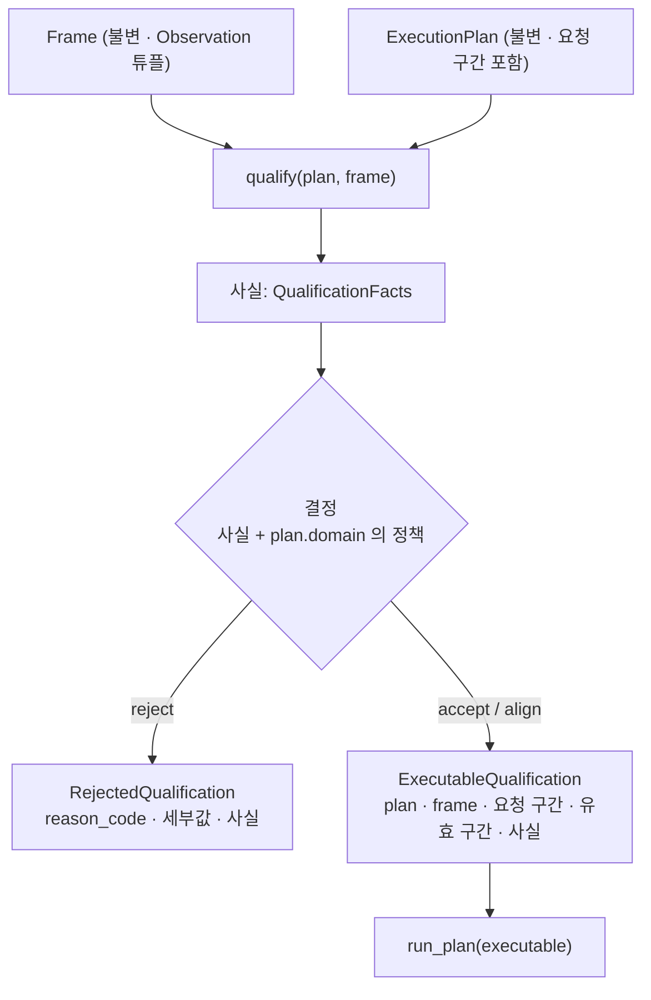

# v2.1 — 정형 데이터 판정(qualification) 설계

## 한눈에 보기

- **문제:** 기간이 온전한지, 비교할 수 있는지 판정하는 로직이 제품 경로(complaints)의 controller 에만 있다. 엔진을 직접 쓰는
  곳(벤치마크, 외부 검증 하네스)에는 이 방어가 없어서, CFPB 외부 검증에서 기간 누락·날짜 이동이 조용히 틀린 결과를 냈다.
- **결정:** 판정을 세 층으로 나눈다 — 사실 관측(qualification) / 도메인이 선언한 정책(`DomainSpec`) / 결정(accept·align·reject).
  엔진은 **판정을 통과한 바로 그 계획·데이터·구간을 봉인한 실행 객체만** 받는다. 판정을 건너뛰는 호출은 표현할 수 없다.
- **보존:** 기존 제품 동작은 한 비트도 바꾸지 않는다. corpus 64 건 출력과 JEV 입력은 v2.1 출발 커밋과 바이트 동일해야 한다.
- **추가:** 합 지표에 그룹 진입·이탈 개수를 사실로 노출한다(`group_transition`).
- **이번에 하지 않는 것:** 평가기(DIRECT/INCIDENTAL/MISS) 개선과 CFPB 재검증, BTS 외부 검증. 엔진 동작이 확정된 뒤 별도 작업으로 한다.

출발 커밋: `320ba68` (main, `v2.0.0` 엔진 + CFPB 외부 검증 + backlog). 배경: [`findings.md`](../../../validation/external/cfpb/findings.md),
[`post-release-backlog.md`](../../post-release-backlog.md).

## 문제

지금 기간 판정은 `bia/integrity.py` 의 두 함수가 한다. `inspect_period` 는 한 기간의 사실(관측 일수, 누락일, 중복)을 세고,
`decide_comparability` 는 두 기간을 비교할 수 있는지 결정한다. 문제는 세 가지다.

1. **판정이 제품 경로에만 있다.** controller 가 이 함수들을 부른 뒤 엔진에 구간을 넘긴다. 엔진(`run_plan`)은 grain 충돌만
   보고 기간은 보지 않는다. 엔진을 직접 부르면 기간 방어가 통째로 빠진다.
2. **한 함수에 세 층이 섞여 있다.** `decide_comparability` 안에 무결성 거부(충돌, 빈 기간), 부분 기간 정책(구간 정렬),
   그 정책의 거부(공통 구간 부족)가 함께 있다. 임계값 7 일·50% 는 complaints 의 정책인데 엔진의 법칙처럼 박혀 있다.
3. **결과 문장이 도메인 전용이다.** 거부 사유 문장에 "(day, product, complaint_type)" 같은 complaints 문구가 들어 있고,
   이 문장이 실행 기록에 직렬화된다.

## 결정

### 원칙

- 무결성 실패와 부분 기간 처리는 다른 개념이다. **`reject` 는 정책 값이 아니라 결정의 결과다.**
- qualification 은 사실을 관측하고 정책을 적용해 실행 가능한 범위를 결정한다. 산술 엔진은 그 결정의 존재를 요구하지만,
  그 결정을 만드는 책임은 갖지 않는다.
- **엔진은 qualification 을 통과한 바로 그 계획·데이터·구간만 실행한다.**
- 무결성 판정의 적용 범위와 순서는 기존 제품 경로의 의미를 보존한다. 새 구조를 이유로 순서를 새로 만들지 않는다.
- 기본 정책은 엄격하게 두고, 관대한 동작은 도메인이 명시적으로 선언한다.

### 흐름



- `run_plan(plan, rows)` 는 **없앤다.** 실행 API 는 `run_plan(executable)` 하나다. 계산 구간은 `executable` 의 유효 구간에서만 온다.
- `ExecutableQualification` 은 qualification 모듈의 factory 에서만 만든다. 이름은 판정 결과지만 역할은 **실행 권한** 에 가깝다.
- align 은 데이터를 자르지 않는다. 유효 구간만 정하고, 행 선택은 기존 실행 계층이 유효 구간으로 한다.
- 지금 `run_plan` 안에 있는 grain 충돌 검사는 qualification 의 무결성 사실로 옮긴다. 충돌도 `RejectedQualification` 이 된다.
- 실행은 봉인된 객체 안의 plan 만 읽는다. 실행 중 전역 레지스트리를 다시 조회하지 않는다.

### 사실 (QualificationFacts)

| 사실 | 내용 |
|---|---|
| `integrity_violations` | 항목마다 `code`, 범위(`baseline` · `current` · `outside`), 날짜와 grain 키. 빈 값 치환으로 생긴 충돌에는 `caused_by_null_normalization` |
| `coverage` (기간마다 `PeriodCoverage`) | 요청 일수, 관측 일수, 누락일, 관측된 날짜 오프셋 |
| `null_profile` | 요청 구간 안에서 차원별 빈칸 행 수 |
| `duplicate_rows_removed` | 측정값까지 같은 완전 중복을 합친 수(거부 사유 아님) |

- **완전(complete)** 은 요청 구간의 모든 날짜가 최소 한 행 이상 관측됐다는 뜻이다. 행 수나 grain 수와는 무관하다.
- **v2.1 의 기간 판정은 달력 날짜(매일) 기준만 지원한다.** 영업일·주간·사용자 정의 달력은 지원 범위 밖이다.
- **중복:** 같은 grain 에 측정값까지 같으면 한 줄로 합치고 사실로 센다(거부 아님). 측정값이 다르면 충돌이다. 거부하는 것은 충돌 한 종류뿐이다.

### 결정표

위에서부터 처음 맞는 줄에서 끝난다. 3 번 이후 순서는 기존 `decide_comparability` 와 같다.

| # | 조건 | 정책 `reject` | 정책 `align_common_window` | 기존 mode |
|---|---|---|---|---|
| 1 | 빈 값 정책 `reject` 이고 요청 구간 안에 빈 차원값 있음 | reject `missing_required_value` | 같음 | — |
| 2 | 요청 구간 안의 grain 충돌 | reject `conflicting_duplicate` | 같음 | blocked |
| 3 | 한쪽 기간의 관측 일수 0 | reject `empty_period` | 같음 | blocked |
| 4 | 두 기간 모두 완전하고 길이가 같음 | **accept**, 유효 = 요청 | 같음 | full |
| 5 | 그 외 | reject `incomplete_period_coverage` | 6~8 로 | — |
| 6 | 두 기간에 공통으로 있는 날짜 오프셋 없음 | — | reject `insufficient_common_window` (`no_overlap`) | blocked |
| 7 | 공통 연속 구간 길이 < 임계 | — | reject `insufficient_common_window` (`below_minimum`, 길이·임계) | blocked |
| 8 | 그 외 | — | **align**, 유효 = 공통 연속 구간 | aligned_window |

- **충돌(2 번)은 정렬보다 먼저, 요청 구간 전체에서 본다.** 정렬로 잘려 나갈 날짜의 충돌도 거부한다(기존과 같음).
- **정렬은 달력 날짜의 교집합이 아니다.** 각 기간 시작일로부터의 날짜 오프셋 중 두 기간에 모두 있는 **가장 긴 연속 구간** 이다.
  탐색 범위는 `limit` 까지다.
- **임계:**
  ```text
  limit     = min(requested_baseline_days, requested_current_days)
  threshold = max(min_comparable_days, round(min_comparable_ratio * limit))
  ```
  `round` 는 **파이썬의 짝수 반올림** 이다: limit 15 → 7.5 → **8**, limit 29 → 14.5 → **14**. 기존 비교 가능성의 의미를 보존하는
  계약이므로 두 값을 테스트로 고정한다.
- 결정은 사유 코드와 구조화된 세부값(길이·임계·오프셋)만 낸다. 사람이 읽는 문장은 만들지 않는다.

**빈 값 정책별 순서**

```text
null_dimension_policy = reject
  빈 차원값 발견 → reject missing_required_value (정규화·충돌 판정으로 가지 않음)

null_dimension_policy = unknown_group
  빈 값 사실 기록 → (로드 시 이미 __UNKNOWN__ 로 정규화됨) → 중복·충돌 판정
  → 충돌이면 conflicting_duplicate + caused_by_null_normalization
```

**의도한 의미 변화 — 하나.** 엔진 직접 경로에서 **요청 구간 밖 행의 grain 충돌** 은 지금 거부되지만, v2.1 에서는 범위 `outside`
사실로만 기록하고 결정에 영향을 주지 않는다. 계산에 쓰지 않는 행 때문에 분석을 막지 않는다. 제품 경로는 이미 요청 구간만 보므로
변화가 없다. 이 변화에 해당하는 기존 사례·테스트는 없다(v2 C12 의 충돌은 구간 안). corpus 가 잡지 못하는 변화이므로 전용 테스트를 둔다.

### DomainSpec 정책 필드

| 필드 | 값 | 기본 |
|---|---|---|
| `partial_period_policy` | `reject` · `align_common_window` | `reject` |
| `min_comparable_days` | 정수 ≥ 1 | 없음 |
| `min_comparable_ratio` | 0 < x ≤ 1 | 없음 |
| `null_dimension_policy` | `reject` · `unknown_group` | `reject` |

`align_common_window` 는 **opt-in 호환 정책** 이다. 임계 두 값은 전부 있거나 전부 없어야 하며, 유효한 조합은 둘뿐이다.

| 정책 | days | ratio | 결과 |
|---|---|---|---|
| `reject` | 없음 | 없음 | 유효 |
| `align_common_window` | ≥ 1 | (0, 1] | 유효 |
| `align_common_window` | 하나라도 없음 | | spec 생성 오류 |
| `reject` | 하나라도 있음 | | spec 생성 오류 |

알 수 없는 값도 spec 생성 시점에 오류다. 새 필드는 모두 스칼라이고, `metrics` 는 생성 시점에 읽기 전용 매핑으로 바꾼다.

**기존 세 도메인은 지금 동작을 명시한다.**

| 도메인 | 선언 |
|---|---|
| complaints | `align_common_window`, `min_comparable_days = 7`, `min_comparable_ratio = 0.5`, `unknown_group` |
| ecommerce · support_ops | 부분 기간 기본(`reject`) — 26 사례가 모두 완전해 영향 없음, 빈 값 `unknown_group` — C11 이 `__UNKNOWN__` 정규화를 밟음 |

### 빈 값의 출처 보존

정규화 위치는 옮기지 않는다(`Frame` 로드 시 빈칸 → `__UNKNOWN__`). 대신 `Observation` 에 빈칸이었던 차원 이름을 불변 필드
`null_dimensions` 로 남긴다. 정규화를 qualification 뒤로 미루면, 데이터에 문자 그대로 `"__UNKNOWN__"` 인 값과 빈칸이 함께 있을 때
grain 키가 둘로 갈려 **라벨이 같은 그룹이 두 개** 생긴다. 지금은 둘이 같은 키라 한 그룹(또는 충돌)이다. 키와 grain 판정을 바꾸지
않으면서 잃고 있던 사실만 보존한다.

### 합 지표의 진입·이탈 (`group_transition`)

합 분해 결과에 네 개수를 싣는다. 활동 여부는 **값이 0 이 아닌가** 로 본다. 음수 금지 계약이 로드 경로 셋 중 둘에만 있어서
(`Frame` 로드, 외부 데이터 — 번들 시나리오 경로에는 없음) 부호에 기대지 않는다.

| 분류 | 조건 |
|---|---|
| `entered` | `baseline == 0` 이고 `current != 0` |
| `exited` | `baseline != 0` 이고 `current == 0` |
| `persisted` | 둘 다 `!= 0` |
| `inactive` | 둘 다 `0` |

불변식: 네 개수의 합 = 그룹 수. 구조 변화 여부를 판정하는 불리언(`structural_change`)은 두지 않는다 — 임계가 필요한데 사전등록 없이
정할 수 없다. 비율 지표에는 추가하지 않는다(비교 불가 그룹 목록과 `entry_exit_effect` 가 이미 같은 사실을 낸다). 답변에는 연결하지 않는다.

### complaints 호환 뷰

실행 기록과 JEV 입력은 지금의 `Comparability`(mode · reason · 유효 구간)와 `PeriodIntegrity`(completeness · missing_days ·
duplicate_rows_removed …)를 직렬화한다. complaints 어댑터가 결정과 사실로 **이 두 객체를 글자 그대로** 다시 만든다.

- accept → `full`, align → `aligned_window`, reject → `blocked`
- reason 은 기존 문장 여섯 가지를 사유 코드와 세부값에서 렌더링한다(아래 구현 참고). 공용 qualification 에는 제품 문구가 없다.
- `PeriodIntegrity.complete` 는 옛 정의("모든 날짜 관측 **그리고** 충돌 없음")로 다시 만든다. `PeriodCoverage.complete` 는 날짜만 본다.

### legacy 판정 함수

`inspect_period` · `decide_comparability` 는 지우지 않고 **이행을 위한 동결 reference** 로 남긴다. v2.1 구현에 맞추려고 고치지
않는다. 지금은 제품 경로가 계속 쓸 함수와 한 파일에 섞여 있으므로, 1 단계 첫 커밋에서 두 함수와 필요한 타입·상수를 글자 그대로
`bia/legacy_comparability.py` 로 옮긴다. 최종 상태는 `metrics.py` 와 같다 — 제품 경로 import 0, 이중 실행 테스트에서만 사용.

동결 증거는 둘이고 증명하는 것이 다르다.
- **`320ba68` 원본과의 AST 동등성** — 옮기면서 의미를 바꾸지 않았다.
- **추출 직후 파일 해시 고정** — 그 이후 reference 를 고치지 않았다(테스트가 해시를 고정한다).

## 동작 — 단계별 이행

각 단계는 별도 커밋이다. 1~2 단계가 끝나기 전에는 새 방어 기능을 넣지 않는다.

| 단계 | 하는 일 | 제품 경로 | 게이트 |
|---|---|---|---|
| 1 | legacy 추출 · qualification 모듈(사실·정책·결정) · complaints 호환 렌더러 · `DomainSpec` 정책 필드 **선언** · 기준 digest 스크립트를 저장소에 추가 · CFPB 원본 ZIP 영구 보관 | 옛 경로 | 단위 테스트, legacy AST 동등성 |
| 2 | **판정 경계 이중 실행** — 같은 입력으로 legacy 와 `qualify` + 렌더러를 돌려 `PeriodIntegrity` 둘 + `Comparability` 의 `as_dict()` JSON 을 바이트 비교 | 옛 경로 | 32 사례 전부 + 경계 fixture 전부 + 고정 시드 무작위 조합 전부 일치 |
| 3 | **전환** — seam 이 `qualify` → `run_plan(executable)`, `run_plan(plan, rows)` 제거, controller 는 호환 뷰를 받음. 정책 강제 시작 | 새 경로 | **출력 변경 0**: corpus·JEV digest 일치, v2 26 건·`oracle.json` 정확히 동일 |
| 4 | 합 지표 `group_transition` + oracle 확장 | 새 경로 | `strip_v21_fields(new_oracle) == old_oracle`, 새 필드 세 도메인 독립 검증 |

1 단계에서 정책 필드를 **선언** 만 하는 이유: 새 결정 함수가 complaints 의 `align` 파라미터를 읽어야 이중 실행을 할 수 있다.
엔진 경로의 **강제** 는 3 단계에서 시작한다.

2 단계의 경계 fixture 는 legacy 함수가 정답이다: limit 15 · 29, 두 기간 길이가 다름, 공통 오프셋 없음, 임계 바로 아래·위, 빈 기간,
구간 안 충돌, 구멍이 여러 개라 연속 구간이 여럿인 경우. 여기에 고정 시드로 뽑은 무작위 조합(기간 1~31 일 × 날짜별 존재 여부)
수천 건을 더한다.

**3 단계의 부작용.** `run_plan(plan, rows)` 가 사라지면 봉인된 v2.0 CFPB 하네스는 main 에서 돌지 않는다. 봉인 자산이라 고치지
않는다. 하네스 README 에 재현 지점을 적는다(완료 기준 ⑦).

## 완료 기준

| # | 기준 | 검증 |
|---|---|---|
| ① | 제품 동작 보존 | corpus 64 건 digest = `745c844c252e6f051c1fb9643131fd05477317d5f214c5d0264688fe074d5057`, JEV 입력(64 실행 · 65 호출) digest = `df7d92aec55eb4a627ebea351f4bd61dcac1a3612c08da293677cd8936f854fc` — 둘 다 `320ba68` 에서 생성(아래 정의) |
| ② | 공용 엔진 보존 | 3 단계: v2 26 건 결과와 `oracle.json` 정확히 동일 / 4 단계: `strip_v21_fields(new) == old`, `expect_group_transition` 은 엔진을 보지 않는 oracle 이 CSV 에서 계산, 세 도메인 모두 |
| ③ | 엔진 직접 경로의 기계적 강제 | `run_plan` 은 `ExecutableQualification` 만 받는다. `run_plan(plan, rows)` 는 없다 |
| ④ | 진입·이탈 신호 | 합 분해에 `group_transition`, `!= 0` 정의, 네 개수 합 = 그룹 수 |
| ⑤ | 우회 불가 — 테스트 7 종 | qualification 없이 실행 불가 · reject 는 실행 불가 · accept 는 실행 · align 은 유효 구간으로 실행 · 실행 전 frame 교체는 표현할 API 가 없음 · plan 교체도 없음 · `Frame`·plan·`DomainSpec.metrics` **내부** 사후 변경이 실제로 실패 |
| ⑥ | legacy 동결 | 제품 경로 import 0(AST) · `320ba68` 원본과 AST 동등 · 추출 후 해시 고정 · 2 단계 이중 실행 전부 일치 |
| ⑦ | 재현 가능성 | 하네스 README 에 엔진 `v2.0.0`(`76bdb1f`) · 재현 진입점 `3d961e7` · 봉인 경계 `78576a9` · 절차를 적고, 일회용 clone 에서 **실제로 재현** 해 결과가 봉인본과 같음을 확인 |
| ⑧ | 회귀 | `tests/` 전체 3.9 · 3.11 통과, `scripts/check_v2bench.py` 일반 · `-O` 통과 |

**개별 계약 테스트:** 짝수 반올림(15 → 8, 29 → 14) · 임계 두 값 전부 있거나 전부 없음 · 빈 값 `reject` 가 정규화 전에 끝남 ·
빈 값 치환 충돌에 `caused_by_null_normalization` · 구간 밖 충돌은 사실로만 기록 · `complete` 는 서로 다른 날짜 기준.

**digest 정의.** 1 단계에서 두 digest 를 만드는 스크립트를 저장소에 넣는다(지금은 저장소 밖 임시 스크립트로 만들었다).
- corpus: 24 시나리오 + 8 챌린지를 `heuristic`·`greedy` 로 실행한 `RunResult.as_dict()` 를 `json.dumps(…, ensure_ascii=False)`
  (정렬 없음)로 직렬화해 `{"<사례>/<선택기>": 문자열}` 을 만들고, 그 dict 를 `json.dumps(…, ensure_ascii=False, sort_keys=True)` 한
  UTF-8 바이트의 SHA-256.
- JEV: 같은 64 실행에서 decision 호출마다 `jev.serialize_state(state.view())` 문자열을 기록하는 위임형 선택기로 `[[사례, 선택기,
  [호출 문자열 …]] …]` 을 만들고, (사례, 선택기) 순으로 정렬해 `json.dumps(…, ensure_ascii=False)` 한 UTF-8 바이트의 SHA-256.
- 기준 생성은 격리 worktree(`git worktree add --detach`)에서 하고 로드된 모듈 경로를 기록한다.

**CFPB 재현 절차(⑦).** 봉인된 결과를 다시 만들려면 두 가지가 필요하다.

1. **봉인 당시의 원본 ZIP 그 자체**(348,672,205 바이트, SHA-256 `011a91dd4c4ed10a9da4e16acc2411db849099745b673b4a976d55fffd65372e`).
   `run.py` 가 M1(원본 로더 손상)과 깨끗한 실행의 파생을 만들 때 획득 기록의 경로(`/tmp/bia-cfpb-raw/complaints.csv.zip`)에서
   이 파일을 읽는다. CFPB 는 매일 갱신되는 파일만 제공하고 과거 스냅샷을 제공하지 않으므로, **다시 받아서는 같은 파일을 얻을 수
   없다.** 그래서 `fetch.py` 는 재현 절차에 넣지 않는다 — 받은 바이트 수가 봉인 당시 `Content-Length` 와 다르면 멈추도록 봉인돼 있다.
   원본 ZIP 은 저장소에 넣지 않는다(소비자 서술문 포함, 100 MB 초과). **저장소 밖의 영구 위치에 보관하고 해시를 기록한다** — 1 단계 작업에 포함.
2. **로컬 `main` 을 재현 지점에 맞춘 일회용 clone.** 봉인된 하네스의 범위 가드가 작업 트리를 로컬 `main` 과 비교하기 때문이다.

```text
git clone <repo> cfpb-repro && cd cfpb-repro
git checkout -B main 3d961e7                     # 로컬 main 을 재지정한다 — 일회용 clone 에서만
mkdir -p /tmp/bia-cfpb-raw && cp <보관한 ZIP> /tmp/bia-cfpb-raw/complaints.csv.zip
shasum -a 256 /tmp/bia-cfpb-raw/complaints.csv.zip   # 011a91dd… 와 같아야 한다
python3 validation/external/cfpb/run.py          # fetch.py 는 돌리지 않는다
```

⑦ 의 완료는 문서를 쓰는 것이 아니라 **이 절차를 일회용 clone 에서 실제로 돌려 `results/` 가 봉인본과 같게 나오는 것** 이다
(`run_meta.json` 처럼 실행 시각·HEAD 를 담는 파일은 비교에서 뺀다 — 뺀 파일 목록을 함께 기록).

## 제외 범위

- 매일 외의 달력(영업일 · 주간 · 사용자 정의)
- 빈 값 정규화 순서 변경(backlog P2)
- `group_transition` 의 답변 연결, 비율 지표용 전이 신호, `structural_change` 불리언
- 로드 경로 셋의 음수 계약 통일(backlog 에 추가)
- DIRECT / INCIDENTAL / MISS 평가기, CFPB 재검증 — 별도 작업, 새 사전등록 · 새 하네스 디렉터리
- BTS 외부 검증(v2.2)
- 봉인된 v2.0 하네스 수정

## 구현 참고

**기존 reason 문장 여섯 가지** (`decide_comparability`, `320ba68`) — complaints 렌더러가 글자 그대로 만든다.

| 사유 코드 | 문장 |
|---|---|
| `conflicting_duplicate` | `conflicting_duplicate_rows: the same (day, product, complaint_type) key carries two different counts, so no count can be trusted` |
| `empty_period` | `empty_period: one of the periods has no rows` |
| accept | `both periods are complete and equal in length` |
| `insufficient_common_window` / `no_overlap` | `no_comparable_window: no day-offset is present in both periods` |
| `insufficient_common_window` / `below_minimum` | `no_comparable_window: longest aligned window is %d day(s), below the required %d` (길이, 임계) |
| align | `periods are not equally complete; compared on the aligned day-offset window %d..%d` (시작 오프셋 + 1, 끝 오프셋 + 1) |

`missing_required_value` · `incomplete_period_coverage` 는 complaints 가 밟지 않으므로(각각 `unknown_group`, `align` 선언) 기존 문장이 없다.

**바뀌는 파일(예상)**

| 파일 | 변경 |
|---|---|
| `bia/legacy_comparability.py` | 신규 — `inspect_period`·`decide_comparability`·관련 타입을 글자 그대로 추출, 동결 |
| `bia/analysis/qualification.py` | 신규 — 사실·결정·`RejectedQualification`·`ExecutableQualification`·factory |
| `bia/analysis/frame.py` | `Frame`(불변 튜플), `Observation.null_dimensions` |
| `bia/analysis/spec.py` | 정책 필드 · 조합 검증 · `metrics` 읽기 전용 |
| `bia/analysis/engine.py` | `run_plan(executable)` 만, grain 충돌 검사 제거(qualification 으로), 합 분해 `group_transition` |
| `bia/domains/*.py` | 세 도메인의 정책 명시 |
| `bia/adapters/complaints.py` · `bia/complaint_analysis.py` · `bia/controller.py` | seam 이 `qualify` → `run_plan`, `Comparability`·`PeriodIntegrity` 호환 뷰 |
| `bia/v2bench/generate.py` · `scripts/check_v2bench.py` | 4 단계 `expect_group_transition` 독립 계산 |
| `validation/external/cfpb/README.md` | 재현 지점 · 절차 |
| `docs/post-release-backlog.md` | 음수 계약 통일 항목 추가 |
